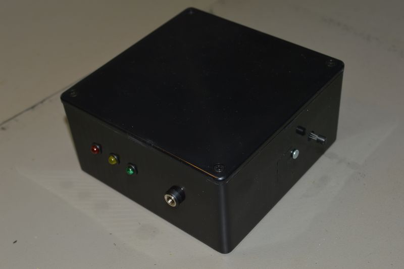

## Source code for project: [Temperature and auxiliary sensor (RS485)](https://link.stdout.no/j)

Temperature and auxiliary sensor with RS485 communication, uses an AVR ATmega8 microcontroller.

Written in basic, using [Bascom-AVR](http://www.mcselec.com/).

### Author
[Thomas Jensen](https://thomas.stdout.no)
